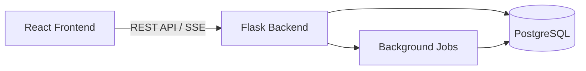

# TIME – Personal Investment Analytics Platform

<div align="left" style="display: flex; flex-wrap: wrap; gap: 0.5rem; align-items: center; margin: 0.75rem 0;">
  
  
  
  
  
  
</div>

---

## 1. Project Overview

**TIME (Time Invest My Elevation)** is a personal investment analytics platform focused on **transaction-level accuracy, auditable financial logic, and quantitative performance evaluation**.


This project is designed as a **research-oriented engineering system** and is used as a portfolio project for applying to a **Master’s program in Computer Science**.


TODO 这里放gif


### License

MIT License - Open source for academic review purposes

---

## 2. Problem Statement & Motivation

目前的市面上各种基金股票交易软件很多，投资者可能在很多平台购买了金融产品，但是缺少对整体的投资水平的记录、评价和回顾。这个项目解决了这个痛点，它可以聚合跨平台的交易数据，并且根据用户的交易记录生成分析数据，并根据一定财务计算逻辑对用户的操作进行评价。

The system aggregates investment data across multiple platforms and reconstructs portfolio states strictly from transaction records, enabling reliable analysis, validation, and future research extensions.


Most retail investment tools prioritize visualization while abstracting away core financial logic, making them unsuitable for verification, analysis, or academic research.

This project aims to:

- Explicitly modeling **transactions, holdings, and historical data**
- Ensuring **fully derivable and auditable portfolio states**
- Supporting **time-window–based quantitative analytics**
- Providing a scalable foundation for **backtesting, risk analysis, and attribution research**

The system is designed at the intersection of **finance, data modeling, and software engineering**.

---

## 3. Architecture

The system adopts a **front-end / back-end separated architecture**.




### Backend

- Flask-based
- Layered design: Route → Service → Model
- Snapshot-based analytics computation
- Scheduled background jobs

### Frontend

- React + Vite
- Tailwind CSS
- Multi-language (ZH / IT / EN) support
- Dashboard-oriented UI design

## 4. Tech Stack

### Backend

- Python 3.11
- Flask
- SQLAlchemy
- PostgreSQL 15
- Marshmallow
- JWT Authentication + HttpOnly Cookie
- Flask-Caching
- Flask-Babel

### Frontend

- React 18
- Vite
- Tailwind CSS
- ECharts
- Server-Sent Events (SSE)
- i18next
- Axios

### Test

- Pytest

### Operation

- Docker

---

## 5. Key Features

### 5.1 Dashboard

- Portfolio overview and period-based summaries
  - Market value
  - Profit and loss (PnL)
  - Time-Weighted Rate of Return (TWRR)
  - Internal Rate of Return (IRR)
- Risk indicators
  - Sharpe Ratio
  - Maximum drawdown
  - Annualized volatility
  - Win rate

- Recent alert signals to buy or sell
- Cached high-frequency dashboard queries using Flask-Caching

### 5.2 Holdings Management

- Unified management of cross-platform holdings
- Data ingestion via crawler or Excel import
- Position tracking derived from transaction aggregation

### 5.3 Transaction Management

- Transaction ingestion via Excel or LLM-assisted OCR (screenshots)
- Dynamic field computation to avoid input errors

### 5.4 Alerts & Signals

- Rule-based monitoring on price of specified holding
- Automatic email notifications when trigger conditions are met

### 5.5 Historical Data & Trends

- Full historical price crawling or time-range crawling
- Daily background jobs for price updates

### 5.6 Tasks & Logs

- Manual triggering of background jobs
- Execution logs and result inspection

### 5.7 Authentication

- Silent pre-refresh of authentication tokens to ensure seamless user experience
- Support for up to three concurrent active devices per user account

---
## 5. Data Model 


## 6. Analytics

This project implements a **production-grade portfolio analytics engine** with accounting-consistent performance measurement.

### Core Design

- Daily **asset-level snapshots** are generated by aggregating all positions, serving as the single source of truth.
- All analytics are derived from historical snapshots, ensuring **full reproducibility and auditability**.

### Return Measurement

- **Time-Weighted Rate of Return (TWRR)**
   Computed via geometric chaining of daily returns, suitable for manager performance evaluation.
- **Money-Weighted Return (IRR / XIRR)**
   Derived from real cash flows (buy/sell, dividends, terminal value) using robust numerical solvers.

### Risk & Performance Metrics

- Annualized return and volatility
- Maximum drawdown (with start, trough, and recovery dates)
- Sharpe, Sortino, and Calmar ratios
- Win rate and return distribution statistics

### Window-Based Analytics

- Expanding windows (entire history)
- Rolling windows (e.g. 21 / 63 / 126 / 252 trading days)

### Financial Integrity

- Strict separation of **cash flows vs. valuation effects**
- Recursive accounting identities guarantee balance consistency
- Safe handling of partial liquidation and full clearance scenarios

This architecture reflects **real-world portfolio accounting and quantitative research standards**, rather than simplified backtesting assumptions.

## 8. Deployment & Running

This project is already deployed on www.wechiwin.com/xxx, also it can be run locally with following steps:

### Backend

```bash
cd backend
pip install -r requirements.txt
flask run
```

### Frontend

```bash
cd frontend
npm install
npm run dev
```

---

## 9. Future Improvements

Planned improvements include:
- Support for additional transaction types (currently OTC funds only)
- Natural-language-driven alert configuration
- Cost or income rebalancing support in alerts management
- AI-assisted portfolio evaluation in dashboard
- More data ingestion methods
- Risk attribution analysis
- Text-to-SQL / LLM-assisted querying
- UI and interaction refinement

---

## 10. About the Author

Author: Wei Qirui


Email: weiqirui8888@gmail.com


Background:
- Bachelor's degree in Financial Management
- Senior Java Engineer with 5+ years of backend and data engineering experience
- Strong interest in software engineering

