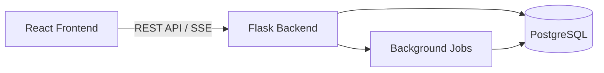
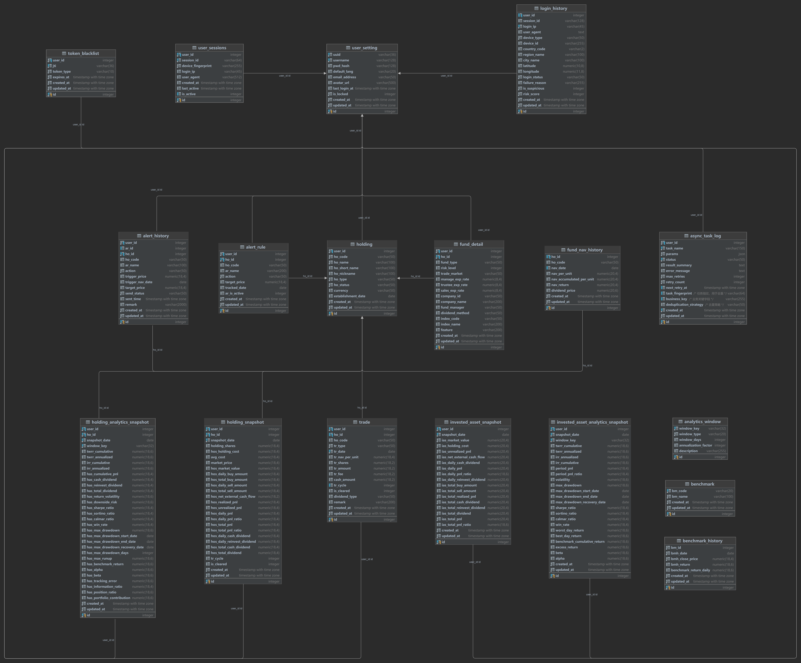

# TIME – Transaction-based Investment Management Engine

<div align="left" style="display: flex; flex-wrap: wrap; gap: 0.5rem; align-items: center; margin: 0.75rem 0;">
  
  
  
  
  
  
</div>

---

## 1. Project Overview

**TIME (Transaction-based Investment Management Engine)** is a personal investment analytics platform designed to ensure **transaction-level accuracy, auditable financial logic, and quantitative performance evaluation**.


This project functions as a research-oriented engineering system, serving as a technical portfolio for Master’s program applications.
### License

MIT License - Open source for academic review purposes

---

## 2. Problem Statement & Motivation

While numerous commercial trading platforms exist, retail investors often suffer from data fragmentation, lacking a unified system to record, evaluate, and review aggregate investment performance across different accounts. Existing tools typically prioritize execution over holistic retrospective analysis.

This project addresses these limitations by consolidating cross-platform transaction data. It reconstructs portfolio history to generate analytical metrics, evaluating user performance based on standardized financial accounting logic.

Unlike most retail tools that abstract away core financial calculations, this system prioritizes:

- **Explicit modeling** of transactions, holdings, and historical states.
- **Derivable and auditable** portfolio states.
- **Time-window–based** quantitative analytics.
- A scalable foundation for **backtesting, risk analysis, and attribution research**.

The system is positioned at the intersection of **financial engineering, data modeling, and full-stack software development**.

---

## 3. Architecture

The system adopts a **decoupled client-server architecture**.



### Backend

- Flask-based
- Layered design: Route → Service → Model
- Snapshot-based analytics computation
- Scheduled background jobs

### Frontend

- React + Vite
- Tailwind CSS
- Multi-language (ZH / IT / EN) support

## 4. Tech Stack

### Backend

- Python 3.11
- Flask
- SQLAlchemy
- PostgreSQL 15
- Marshmallow
- JWT Authentication + HttpOnly Cookie
- Flask-Caching
- Flask-Babel

### Frontend

- React 18
- Vite
- Tailwind CSS
- ECharts
- Server-Sent Events (SSE)
- i18next
- Axios

### Test

- Pytest

### Operation

- Docker

---

## 5. Key Features

### 5.1 Dashboard
- **Portfolio Overview:** Period-based summaries including Market Value and PnL.
- **Return Metrics:** Time-Weighted Rate of Return (TWRR) and Internal Rate of Return (IRR).
- **Risk Indicators:** Sharpe Ratio, Maximum Drawdown, Annualized Volatility, and Win Rate.
- **Performance:** High-frequency queries optimized via Flask-Caching.

### 5.2 Holdings Management
- Unified management of cross-platform assets.
- Data ingestion via web scraping or batch Excel import.
- Position tracking derived strictly from transaction aggregation.

### 5.3 Transaction Management
- Support for manual entry, Excel upload, or LLM-assisted OCR (from screenshots).
- Dynamic field computation to minimize input errors.

### 5.4 Alerts & Signals
- Rule-based monitoring for specific holding prices.
- Automated email notifications upon trigger conditions.

### 5.5 Historical Data & Trends
- Automated crawling of historical price data (full history or specific time ranges).
- Daily scheduled jobs for market data updates.

### 5.6 Tasks & Logs
- Interface for manual triggering of background jobs.
- Comprehensive execution logs for system monitoring.

### 5.7 Authentication
- Silent token refresh mechanisms for seamless user sessions.
- Concurrency control limiting active sessions to three devices.

---

## 6. Data Model

The database schema is designed to ensure referential integrity between transactions, snapshots, and asset definitions.



---

## 7. Analytics Engine

This project implements a **production-grade portfolio analytics engine** consistent with standard accounting practices.

### Core Design

- **Daily Snapshots:** Asset-level snapshots are generated daily by aggregating all positions, serving as the single source of truth.
- **Reproducibility:** All analytics are derived from historical snapshots, ensuring full auditability.

### Return Measurement

- **Time-Weighted Rate of Return (TWRR):** Computed via geometric chaining of daily returns to evaluate strategy performance independent of external cash flows.
- **Money-Weighted Return (IRR / XIRR):** Derived from actual cash flows (buy/sell, dividends, terminal value) using numerical solvers.

### Risk & Performance Metrics

- Annualized return and volatility.
- Maximum drawdown (identifying peak, trough, and recovery dates).
- Sharpe, Sortino, and Calmar ratios.
- Return distribution statistics.

### Window-Based Analytics

- **Expanding Windows:** Analytics covering the entire investment history.
- **Rolling Windows:** Analytics over fixed periods (e.g., 21, 63, 126, 252 trading days).

### Financial Integrity

- Strict separation of **cash flows vs. valuation effects**.
- Recursive accounting identities guarantee balance consistency.
- Robust handling of partial liquidations and full clearance scenarios.

---

## 8. Deployment & Execution

A live demonstration of the system is available at https://app.wechiwin.com

For local development or testing, adhere to the following setup procedures:

### Backend

```bash
cd backend
pip install -r requirements.txt
flask run
```

### Frontend

```bash
cd frontend
npm install
npm run dev
```

---

## 9. Future Improvements

Planned enhancements to the system include:

- Support for diverse asset classes (expanding beyond OTC funds).
- Support for diverse countries (expanding beyond Chinese market).
- Natural Language Processing (NLP) for alert configuration.
- Inclusion of transaction costs and dividend reinvestment in alert logic.
- AI-assisted portfolio commentary and evaluation.
- Expanded data ingestion pipelines.
- Risk attribution analysis.
- Text-to-SQL capabilities for ad-hoc reporting.
- Refinement of UI/UX interactions.

---

## 10. About the Author

**Qirui Wei**

Email: weiqirui8888@gmail.com

Background:
- Bachelor's degree in Financial Management
- Senior Java Engineer with years of backend and data engineering experience
